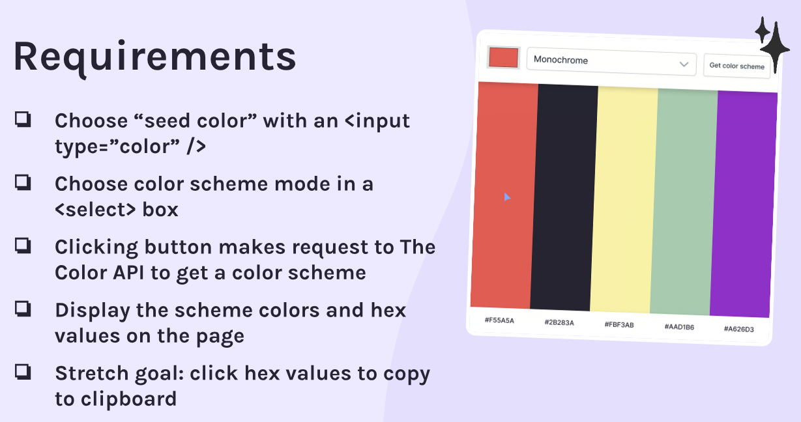

## Color Scheme Picker

### The requirements:

### How does the app work?

- User picks a "seed color", selects a color scheme (monochrome, complement, etc.), clicks a button to get the color scheme and the colors display in a column - including the HEX values for each color.

### Process

- Consult Figma design files
- Create draft of README file
- Create .gitignore file and check that meta tag is included
- Create Github repository
- Work on HTML, CSS and JS files
- Check final code and accessibility
- Finalize README file
- Publish live URL

### Challenges along the way

- Have problems making the options dropdown box dark

### Resources:

[How to create a dropdown list](https://www.freecodecamp.org/news/html-drop-down-menu-how-to-add-a-drop-down-list-with-the-select-element/)

[Copy text to clipboard](https://www.w3schools.com/howto/howto_js_copy_clipboard.asp)

[Light/Dark Mode toggle](https://codepen.io/sashatran/pen/rPaLgG)

[How to create a dark/light theme toggle](https://www.florin-pop.com/blog/2019/05/dark-light-theme-toggle/)

[How to make tooltips with only CSS](https://www.youtube.com/watch?v=ujlpzTyJp-M)

[tippy.js](https://atomiks.github.io/tippyjs/)

[sweet alert](<(https://sweetalert2.github.io/)>)
